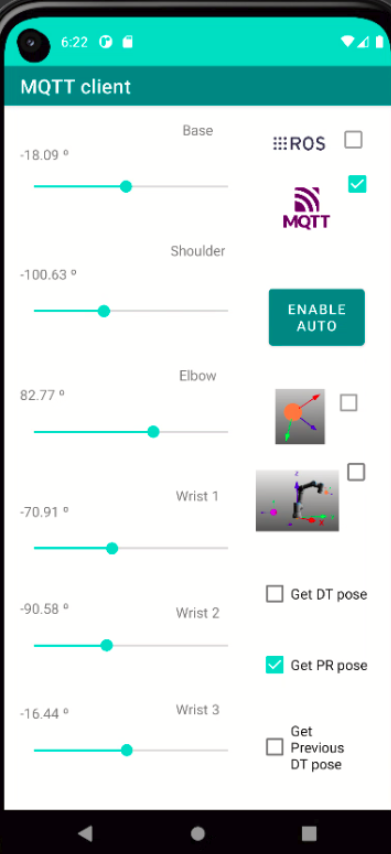

---

## Overview

This repository contains the source code developed for integrating the **IoRT-in-Hand** architecture, a system designed to enable the remote operation of robotic manipulators through a smartphone that hosts both **ROS nodes** and **MQTT clients**. The application facilitates seamless control while offering comprehensive visual feedback by integrating video streams from multiple sources—including both **IP-based cameras** and **ROS-native image topics**—within a unified mobile interface.

A key innovation introduced by this system is the **real-time rendering of a digital twin (DT) directly on the smartphone screen**, allowing the operator to preview robotic motions in a virtual environment (via Verosim) before executing them in the physical workspace. This enhances situational awareness, safety, and training capabilities.

The mobile app connects to a **cloud-based MQTT broker**, which circumvents common **NAT traversal issues** inherent to ROS 1 and ROS 2, enabling reliable communication across public and private networks.

Users can intuitively switch between the **ultrasound camera feed** and the **digital twin visualisation**. Motion commands are issued using two **virtual joysticks**—one for planar (XY) motion and another for vertical (Z-axis) control—operating the end-effector in velocity mode. Tactile feedback is presented via **force measurements**, displayed as color-coded warnings (green/yellow/red) to inform the operator of the contact pressure exerted on the patient during scanning.

Additionally, the hardware design includes CAD models and mechanisms developed for **REBOA procedures** (Resuscitative Endovascular Balloon Occlusion of the Aorta), incorporating a robotic needle insertion system to enhance its medical capabilities.

---

## Purpose

The application provides the following core functionalities:

- **Remote teleoperation** of a 6-DOF robotic manipulator via on-screen joysticks (XY + Z axes).
- **Real-time visualisation** of the eye-in-hand camera (IP stream) directly on the mobile screen.
- **Digital Twin integration**, enabling visual feedback through Verosim or live ultrasound imaging—toggleable via the DT/US buttons.
- **Force-aware interaction**, featuring a ROS-based subscriber that displays pressure feedback using a traffic-light interface.
- **Assistant-side video streaming**, enabled through a secondary smartphone using the UMA-ROS-Android app (optional).

---

## End‑to‑end data‑flow

The following ASCII diagram summarises how a single ArUco detection propagates through the system, from raw camera frame to consumption by an external client such as Verosim or the mobile app:


**Summary**  
The homogeneous matrix **T** determines the pose of each detected marker (and therefore of the wearable band attached to the patient's leg) in the world frame. Once published via MQTT:

* The **digital twin (Verosim)** updates the limb pose in real time.
* The **mobile app** can compute distances and generate safe motion commands.
* **External observers** can passively subscribe to the data for educational or monitoring purposes.

---

## New features over original ROS‑Mobile

1. **IP and screen-stream visualisation**: dedicated tab for RTSP feeds and TCP socket inputs.
2. **Traffic-light force display widget**: colour-coded feedback (green, yellow, red).
3. **MQTT tab**: built-in client with DT-related topic list.
4. **New VizFragment UI**: unified display area for ROS + MQTT elements.


# adhoc-ROS-Mobile

This repository hosts **adhoc-ROS‑Mobile**, an ad‑hoc version of the Android application *ROS‑Mobile* (Rottmann *et al.*, 2020). The app extends the original project by **embedding MQTT clients** alongside **ROS nodes** directly on a smartphone so that a single handheld device can tele‑operate a robotic manipulator, visualise multiple video feeds and interact with a cloud‑hosted digital twin (DT).

---

Main code changes:

* New widget `ButtonSubscriber` for force alerts.  
* Modified `VizFragment.java` and layout `fragment_viz.xml`.  
* Replaced the SSH tab with the MQTT client tab.
---

## MQTT–ROS Bridge Setup

In this project, ROS and MQTT are used together: ROS handles local communication with sensors and robotic systems, while MQTT enables remote interaction (e.g. from mobile devices or cloud-based digital twins). To bridge messages between these two protocols, we use the `mqtt_bridge` package.

### 1 · Install the MQTT–ROS bridge

```bash
cd ~/catkin_ws/src
git clone https://github.com/groove-x/mqtt_bridge.git
cd ..
rosdep install --from-paths src --ignore-src -r -y
catkin_make
source devel/setup.bash
```

Make sure paho‑mqtt is installed in your Python environment (used by the bridge):
```
pip install paho-mqtt
```

### 2 · Create a bridge configuration

Create a file called bridge.yaml in any ROS package:
```
mqtt:
  client:
    protocol: mqtt
    host: 192.168.1.100
    port: 1883

bridge:
  # ROS → MQTT
  - factory: mqtt_bridge.bridge:RosToMqttBridge
    msg_type: std_msgs/String
    topic_from: /end_effector
    topic_to: robot/end_effector

  # MQTT → ROS
  - factory: mqtt_bridge.bridge:MqttToRosBridge
    msg_type: std_msgs/String
    topic_from: teleop/cmd_vel
    topic_to: /cmd_vel

```
Result
Direction	Effect
| Direction  | Effect                                                                  |
| ---------- | ----------------------------------------------------------------------- |
| ROS ➜ MQTT | `/end_effector` is published to the MQTT topic `robot/end_effector`.    |
| MQTT ➜ ROS | Messages on `teleop/cmd_vel` are re‑published to `/cmd_vel` inside ROS. |

### 3 · Launch the bridge

```

roslaunch mqtt_bridge mqtt_bridge.launch \
        config_file:=/absolute/path/to/bridge.yaml


```


The specified ROS and MQTT topics are now transparently connected.

## Preliminary Results

Our architecture was validated in a 2 300 km tele‑ultrasound trial where a 6‑DOF robot scanned a phantom entirely under remote control. Latency, contact‑force accuracy, and user‑experience metrics confirm suitability for both emergency telemedicine and routine remote diagnostics. A manuscript describing these results is currently under review (Sensors, MDPI, SI on Smart Sensing Technologies for Human‑Centred Healthcare).

### Article Summary

We propose a novel Internet of Robotic Things (IoRT) framework for tele‑ultrasound.

IoRT‑in‑Hand integrates:

    a medical ultrasound probe

    an RGB camera with pan/tilt servos

    a 6‑axis force–torque sensor

    an embedded mini‑PC with Wi‑Fi/4G

A dedicated Android app merges ROS and MQTT on a single handset, providing joystick tele‑operation, Digital‑Twin visualisation, and real‑time feedback. To our knowledge, this is the first smartphone‑rendered Digital Twin for medical robotics, enabled by a hybrid Edge–Cloud architecture.

### UI Snapshots
<p align="center">  </p> <p align="center">  </p> <p align="center">  </p>

## How to Use

    Install the Android app on the smartphone.

    Connect the phone, the robot PC, and the Dew device to the same ZeroTier VPN.

    Launch the ROS package in FIS/ on the robot computer.

    The phone can now issue velocity commands and receive video + Digital‑Twin streams.

## References

Rottmann, N., Studt, N., Ernst, F., & Rueckert, E. (2020).
ROS‑mobile: An Android application for the Robot Operating System. arXiv 2001.02781.


