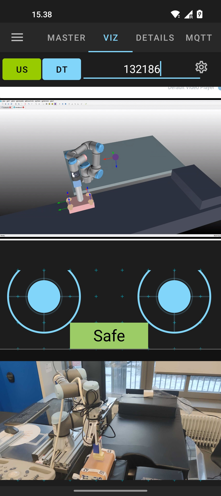

---

## Overview

This repository contains the source code developed for integrating the **IoRT-in-Hand** architecture, a system designed to enable the remote operation of robotic manipulators through a smartphone that hosts both **ROS nodes** and **MQTT clients**. The application facilitates seamless control while offering comprehensive visual feedback by integrating video streams from multiple sources—including both **IP-based cameras** and **ROS-native image topics**—within a unified mobile interface.

A key innovation introduced by this system is the **real-time rendering of a digital twin (DT) directly on the smartphone screen**, allowing the operator to preview robotic motions in a virtual environment (via Verosim) before executing them in the physical workspace. This enhances situational awareness, safety, and training capabilities.

The mobile app connects to a **cloud-based MQTT broker**, which circumvents common **NAT traversal issues** inherent to ROS 1 and ROS 2, enabling reliable communication across public and private networks.

Users can intuitively switch between the **ultrasound camera feed** and the **digital twin visualisation**. Motion commands are issued using two **virtual joysticks**—one for planar (XY) motion and another for vertical (Z-axis) control—operating the end-effector in velocity mode. Tactile feedback is presented via **force measurements**, displayed as color-coded warnings (green/yellow/red) to inform the operator of the contact pressure exerted on the patient during scanning.

Additionally, the hardware design includes CAD models and mechanisms developed for **REBOA procedures** (Resuscitative Endovascular Balloon Occlusion of the Aorta), incorporating a robotic needle insertion system to enhance its medical capabilities.

---

## Purpose

The application provides the following core functionalities:

- **Remote teleoperation** of a 6-DOF robotic manipulator via on-screen joysticks (XY + Z axes).
- **Real-time visualisation** of the eye-in-hand camera (IP stream) directly on the mobile screen.
- **Digital Twin integration**, enabling visual feedback through Verosim or live ultrasound imaging—toggleable via the DT/US buttons.
- **Force-aware interaction**, featuring a ROS-based subscriber that displays pressure feedback using a traffic-light interface.
- **Assistant-side video streaming**, enabled through a secondary smartphone using the UMA-ROS-Android app (optional).

---

## End‑to‑end data‑flow

The following ASCII diagram summarises how a single ArUco detection propagates through the system, from raw camera frame to consumption by an external client such as Verosim or the mobile app:


**Summary**  
The homogeneous matrix **T** determines the pose of each detected marker (and therefore of the wearable band attached to the patient's leg) in the world frame. Once published via MQTT:

* The **digital twin (Verosim)** updates the limb pose in real time.
* The **mobile app** can compute distances and generate safe motion commands.
* **External observers** can passively subscribe to the data for educational or monitoring purposes.

---

## New features over original ROS‑Mobile

1. **IP and screen-stream visualisation**: dedicated tab for RTSP feeds and TCP socket inputs.
2. **Traffic-light force display widget**: colour-coded feedback (green, yellow, red).
3. **MQTT tab**: built-in client with DT-related topic list.
4. **New VizFragment UI**: unified display area for ROS + MQTT elements.


# adhoc-ROS-Mobile

This repository hosts **adhoc-ROS‑Mobile**, an ad‑hoc version of the Android application *ROS‑Mobile* (Rottmann *et al.*, 2020). The app extends the original project by **embedding MQTT clients** alongside **ROS nodes** directly on a smartphone so that a single handheld device can tele‑operate a robotic manipulator, visualise multiple video feeds and interact with a cloud‑hosted digital twin (DT).

---

Main code changes:

* New widget `ButtonSubscriber` for force alerts.  
* Modified `VizFragment.java` and layout `fragment_viz.xml`.  
* Replaced the SSH tab with the MQTT client tab.


## MQTT–ROS Bridge Setup

In this project, ROS and MQTT are used together: ROS handles local communication with sensors and robotic systems, while MQTT enables remote interaction (e.g. from mobile devices or cloud-based digital twins). To bridge messages between these two protocols, we use the `mqtt_bridge` package.

### 1. Install the MQTT–ROS bridge

Clone the official package into your ROS workspace:

```bash
cd ~/catkin_ws/src
git clone https://github.com/groove-x/mqtt_bridge.git
cd ..
rosdep install --from-paths src --ignore-src -r -y
catkin_make
source devel/setup.bash

Make sure paho-mqtt is installed in your Python environment (used by the bridge):

pip install paho-mqtt

### 2. Create a bridge configuration

Inside your ROS package or workspace, create a YAML file (e.g. bridge.yaml) to define the topics to bridge.

Example configuration:

mqtt:
  client:
    protocol: mqtt
    host: 192.168.1.100
    port: 1883

bridge:
  - factory: mqtt_bridge.bridge:RosToMqttBridge
    msg_type: std_msgs/String
    topic_from: /end_effector
    topic_to: robot/end_effector

  - factory: mqtt_bridge.bridge:MqttToRosBridge
    msg_type: std_msgs/String
    topic_from: teleop/cmd_vel
    topic_to: /cmd_vel

This configuration:

    Publishes /end_effector from ROS into MQTT as robot/end_effector

    Subscribes to teleop/cmd_vel on MQTT and republishes it to /cmd_vel in ROS

### 3. Launch the bridge

Use the provided launch file or create one:

roslaunch mqtt_bridge mqtt_bridge.launch config_file:=/path/to/bridge.yaml

Now your MQTT and ROS topics will be transparently connected.


---
---

## Preliminary Results

The proposed system has been evaluated in a multi-site experimental setup, validating its performance for real-world telemedicine applications. The architecture was tested through long-range teleoperation trials—spanning over **2,300 km across Europe**—in which a **6-DOF robotic arm** executed an **ultrasound scanning procedure** controlled remotely via the IoRT-in-Hand interface.

Performance metrics such as **latency**, **sensor feedback quality**, and **user experience** were measured, demonstrating the system’s robustness and applicability in both **emergency scenarios** and **remote diagnostics**. All components of the system—including ROS nodes, MQTT messaging, visualisation pipelines, and joystick control—were exercised under realistic network conditions.

These results and the underlying architecture are detailed in a submitted manuscript currently under review in *Sensors (MDPI), Special Issue: Smart Sensing Technologies for Human-Centered Healthcare*. Further documentation will be made available upon acceptance.

---

### Article Summary

This work introduces a novel **Internet of Robotic Things (IoRT)** framework tailored for **tele-ultrasound applications** in remote, hard-to-access, or hazardous environments. At its core is the **IoRT-in-Hand**—a smart, lightweight end-effector that physically bridges the specialist’s expertise with the robot's execution layer.

The device integrates the following components into a compact, plug-and-play unit:

- A **medical ultrasound probe**
- An **RGB camera with pan/tilt servos**
- A **force–torque sensor** for contact awareness
- An onboard **mini-PC with wireless connectivity**

On the software side, an open-source **Android application** is introduced, enabling intuitive control through the integration of **ROS** and **MQTT** within a single mobile interface.

To the best of our knowledge, this is the **first implementation of a smartphone-rendered Digital Twin for robotic systems**, empowering remote operators—including non-engineers—to interact with and monitor the robot's environment in real time. The system leverages a **hybrid Edge–Cloud architecture**, combining modular hardware, real-time actuation, and cross-platform communication to deliver scalable and accessible robotic telemedicine.

---
<p align="center">
  
</p>

<p align="center">
  <!-- Convert the PDF page to PNG and use the PNG here -->
  
  <!-- OR, if you prefer to leave it as a PDF: -->
  <!-- <a href="images/app-1.pdf">Main Activity (PDF)</a> -->
</p>

<p align="center">
  
</p>


---

## How to use

After installing the app on the smartphone and connecting the VPN (Zerotier) to both the robot system and the Dew device in the IoRT-in-Hand, all components will be interconnected.

Once the ROS package is launched (available under the **FIS** directory), the smartphone is able to interact with and velocity-control the robot's end-effector.

---

## References

Rottmann, N., Studt, N., Ernst, F., & Rueckert, E. (2020). **ROS‑mobile: An Android application for the Robot Operating System**. *arXiv preprint* arXiv:2011.02781.

